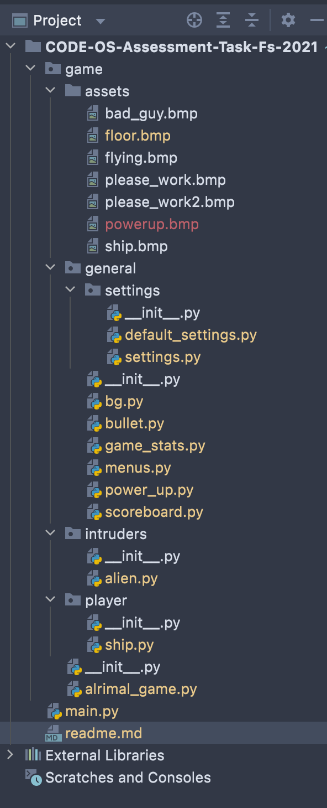

# Stacey Kenny OS_01 Introduction to Software Engineering Assessment Task

This PyGame is part of my CODE University Re-Assessment for OS_01 Software Engineering. While we were shown how to download VS Code, I prefer to use PyCharm and did so for this task.

Please note that all images were drawn by me using [PhotoScape X](http://x.photoscape.org/) and pure talent.

## The Game

An Alien Invasion inspired by DUNE by Frank Herbert and that is the reason for the color scheme and game style.

## The Code

```python
# Starts the game
if __name__ == '__main__':
    # Make a game instance + run the game.
    ai = AlrimalGame()
    ai.run_game()
```

Then game is built according to the Python Crash Course Project 1 found in chapters 12 to 14, 2nd Edition by E. Matthes as well as the instructions provided by the lecturers.
The game has the following desired characteristics:
- A start and retry menu (mouse only visibility when menu is),
- Background + background animation,
- Player ship, which can move left and right with the ability to fire bullets,
- A fleet of aliens descending from above, their intensity increases with each passing level, 👾👾👾👾👾
- 🍺 A GIFT FROM THE HEAVENS! 🍺 A magical ice-cold beer to help get you in the mood to fight, and
- A score board of the current level, your current score, the highest score, fallen foes and how many repair kits (extra lives) you have left, if the alien ship crashes into yours, or passes you... your ship is very baldy damaged.

The game has been structured into various folders (for example; assets, settings, player, etc.) to try give more structure to the game to be able to find and follow the code.


I know of two issues I am currently trying to fix;

1. Hitting 'Q' for quit seems to send you into a waiting room with an unknown expected time of sit and stare...


2. The Free beer is handed to you immediately when you press start if you do so fast enough, maybe a bug, maybe a feature. 🍻

But working on these, but do not think I will this issues will be resolved before the submission date.

I have also refactored the code according to the feedback provided via the CODE Learning Platform and hope the game is more fun to play now that it is more of a game and that the code is easier to follow.

## References

I used the following to better my understanding of Python, PyGame and Coding Concepts to be able to build the game.

1. Coding With Russ. (2021). Pygame Space Invaders Beginner Tutorial in Python - PART 1 | Initial Setup [Image]. Retrieved 29 October 2021, from https://www.youtube.com/watch?v=f4coFYbYQzw&t=20s.
2. Hamedani, M. (2019). Python Tutorial - Python for Beginners [Full Course]. YouTube. Retrieved October 28, 2021, from https://www.https://www.youtube.com/watch?v=_uQrJ0TkZlc&amp;t=11763syoutube.com/watch?v=_uQrJ0TkZlc&amp;t=11763s.
3. Matthes, E. Python Crash Course, 2nd Edition (2nd ed., pp. 1-181, 224-278). No Starch Press, Inc.
